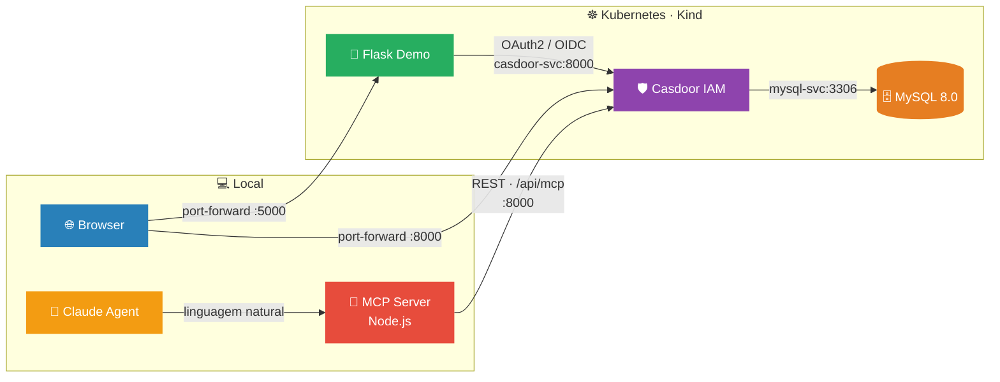
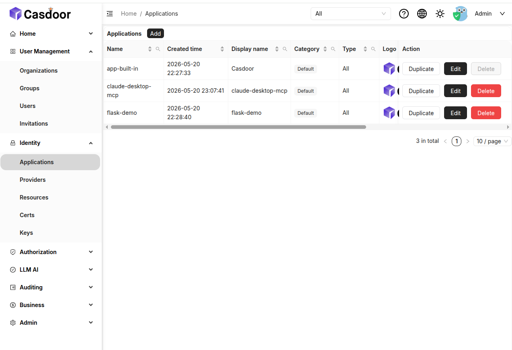
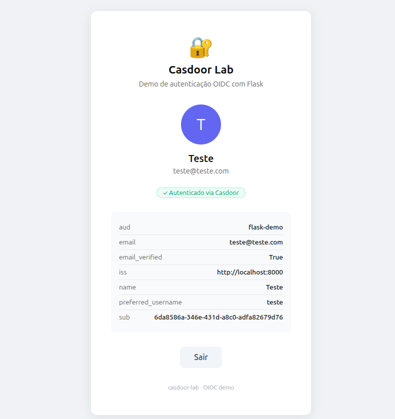
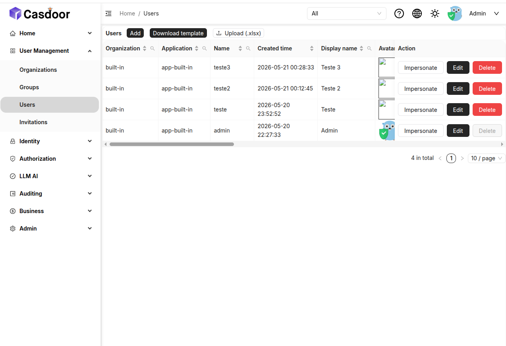
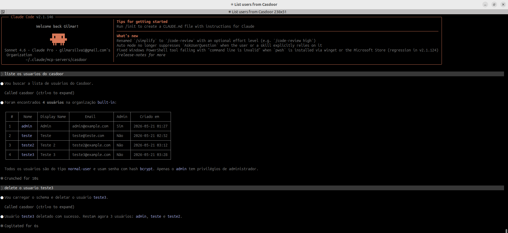

<h1 align="center">Casdoor IAM no Kubernetes com AIvia MCP — OIDC/OAuth2 demo using Flask</h1>

<p align="center">
  
  
  
  
  
</p>

<p align="center">
  Lab de autenticação com <a href="https://casdoor.ai/">Casdoor</a> rodando no Kubernetes,<br>
  demonstrando o fluxo <strong>OIDC/OAuth2</strong> com uma aplicação Flask —<br>
  e como um agente de IA pode administrar o IdP em linguagem natural via <strong>MCP</strong>.
</p>

---

Toda aplicação que exige login precisa de um Identity Provider — um serviço centralizado que autentica o usuário e emite tokens que outras aplicações confiam. O protocolo que padroniza esse fluxo é o **OIDC (OpenID Connect)**, camada de identidade construída sobre o OAuth2.

**Casdoor** é um IAM (Identity and Access Management) open source que implementa OIDC/OAuth2, permitindo centralizar autenticação, gerenciar usuários e integrar aplicações como clientes OAuth2 — sem depender de um provedor de nuvem específico.

Este lab demonstra esse fluxo de ponta a ponta: um cluster Kubernetes local (Kind) com MySQL como backend de dados do Casdoor, e uma aplicação Flask registrada como cliente OAuth2. Além disso, explora como um agente de IA (**Claude**) pode interagir diretamente com o IdP via **MCP (Model Context Protocol)** — criando usuários, listando aplicações e gerenciando roles com comandos em linguagem natural, sem abrir a interface web.

Esse padrão tem impacto direto na administração de identidade em larga escala: operações repetitivas como onboarding de usuários, auditoria de aplicações registradas e rotação de permissões deixam de exigir navegação manual no painel e passam a ser expressas como instruções ao agente.

> [!IMPORTANT]
> O objetivo central é entender o fluxo OIDC — como uma aplicação delega autenticação a um Identity Provider e recebe de volta um token com os dados do usuário — e como a integração com IA via MCP pode simplificar a operação do IdP no dia a dia.

---

## 🗺️ Arquitetura



---

## 📁 Estrutura

```
casdoor-lab/
├── app/
│   ├── app.py              # Flask: rotas /, /login, /callback, /logout
│   ├── requirements.txt
│   ├── Dockerfile
│   └── templates/
│       └── index.html      # UI de login e perfil do usuário
└── k8s/
    ├── namespace.yaml       # Namespace: casdoor
    ├── mysql.yaml           # MySQL 8.0 — Secret, PVC, Deployment, Service
    ├── casdoor-config.yaml  # ConfigMap com app.conf
    ├── casdoor.yaml         # Casdoor — Deployment + Service
    └── app.yaml             # Flask demo — Deployment + Service
```

---

## 🛠️ Pré-requisitos

### Docker

```bash
curl -fsSL https://get.docker.com | sh
sudo usermod -aG docker $USER  # relogar após este comando
```

### kubectl

```bash
curl -LO "https://dl.k8s.io/release/$(curl -sL https://dl.k8s.io/release/stable.txt)/bin/linux/amd64/kubectl"
chmod +x kubectl && sudo mv kubectl /usr/local/bin/
```

### Kind

```bash
curl -Lo /usr/local/bin/kind https://kind.sigs.k8s.io/dl/v0.23.0/kind-linux-amd64
chmod +x /usr/local/bin/kind
```

---

## 🚀 Subindo o lab

```bash
make all         # cria o cluster Kind + build da imagem Flask + deploy completo
make forward-all # port-forward: Casdoor :8000 e Flask :5000
```

---

## ⚙️ Configurando a aplicação no Casdoor

Antes de testar o login, registre a Flask demo como cliente OAuth2:

1. Acesse **http://localhost:8000** — credenciais: `admin` / `123`
2. Vá em **Applications → Add** e preencha:

| Campo | Valor |
|---|---|
| Name | `flask-demo` |
| Client ID | `flask-demo` |
| Client Secret | `flask-demo-secret` |
| Redirect URL | `http://localhost:5000/callback` |

3. Salve e acesse **http://localhost:5000**
4. Clique em **Entrar com Casdoor** — você será redirecionado para o Casdoor, autenticado e trazido de volta com os dados do perfil

A aplicação `flask-demo` aparecerá listada no painel do Casdoor junto com as demais aplicações registradas:



Após autenticar, a Flask exibe o perfil do usuário com os claims do token OIDC emitido pelo Casdoor:



---

## 🤖 Integração com MCP (Model Context Protocol)

[Model Context Protocol (MCP)](https://modelcontextprotocol.io/) é um protocolo aberto que padroniza como ferramentas externas expõem capacidades para modelos de linguagem. O Casdoor expõe um endpoint MCP nativo em `/api/mcp`, e este lab inclui também um servidor MCP customizado com operações mais abrangentes.

### Abordagem 1 — Endpoint nativo do Casdoor (Claude Code CLI)

O Casdoor 1.x expõe nativamente um servidor MCP em `/api/mcp` via HTTP/SSE. O Claude Code se conecta diretamente a ele:

```bash
claude mcp add --transport http \
  --client-id <CLIENT_ID> \
  --client-secret <CLIENT_SECRET> \
  -s local casdoor http://localhost:8000/api/mcp
```

Ferramentas disponíveis neste endpoint:

| Ferramenta | Descrição |
|---|---|
| `get_applications` | Lista todas as aplicações registradas |
| `get_application` | Obtém detalhes de uma aplicação específica |
| `add_application` | Registra uma nova aplicação |
| `update_application` | Atualiza configurações de uma aplicação |
| `delete_application` | Remove uma aplicação |

### Abordagem 2 — Servidor MCP customizado (Node.js)

Para operações além do gerenciamento de aplicações (usuários, roles, organizações), este lab inclui um servidor MCP próprio em `~/.claude/mcp-servers/casdoor/`. Ele foi construído com o SDK oficial do MCP e autentica no Casdoor via Resource Owner Password Credentials.

**Estrutura:**

```
~/.claude/mcp-servers/casdoor/
├── index.js          # servidor MCP com todas as ferramentas
└── package.json      # @modelcontextprotocol/sdk
```

**Ferramentas disponíveis:**

| Ferramenta | Descrição |
|---|---|
| `list_users` | Lista todos os usuários de uma organização |
| `get_user` | Obtém detalhes de um usuário |
| `add_user` | Cria um novo usuário |
| `update_user` | Atualiza dados de um usuário |
| `delete_user` | Remove um usuário |
| `list_organizations` | Lista as organizações cadastradas |
| `list_applications` | Lista as aplicações cadastradas |
| `list_roles` | Lista os roles cadastrados |

**Registro no Claude Code:**

```bash
claude mcp add casdoor node ~/.claude/mcp-servers/casdoor/index.js \
  -e CASDOOR_URL=http://localhost:8000 \
  -e CASDOOR_CLIENT_ID=<CLIENT_ID> \
  -e CASDOOR_CLIENT_SECRET=<CLIENT_SECRET> \
  -e CASDOOR_USERNAME=admin \
  -e CASDOOR_PASSWORD=<SENHA>
```

Os usuários criados via MCP aparecem imediatamente na interface do Casdoor:



### Abordagem 3 — Claude Desktop via mcp-remote

Para usar o endpoint nativo do Casdoor no Claude Desktop, adicione ao `claude_desktop_config.json`:

- **Linux:** `~/.config/claude-desktop/claude_desktop_config.json`
- **macOS:** `~/Library/Application Support/Claude/claude_desktop_config.json`

```json
{
  "mcpServers": {
    "casdoor": {
      "command": "npx",
      "args": [
        "mcp-remote",
        "http://localhost:8000/api/mcp",
        "--static-oauth-client-info",
        "{\"client_id\":\"<CLIENT_ID>\",\"client_secret\":\"<CLIENT_SECRET>\"}"
      ]
    }
  }
}
```

O `mcp-remote` faz a ponte entre o protocolo stdio local e o endpoint HTTP do Casdoor, autenticando via OAuth2.

### Exemplos de uso

Com o lab rodando e qualquer uma das abordagens configurada, você pode pedir ao Claude em linguagem natural — ele chama o MCP automaticamente:

> *"Liste os usuários cadastrados no Casdoor"*
>
> *"Crie um usuário chamado `joao` com e-mail `joao@example.com`"*
>
> *"Qual é o client_id da aplicação flask-demo?"*
>
> *"Liste todas as aplicações registradas"*

Abaixo, o Claude Code listando os usuários e em seguida deletando `teste3` via servidor MCP customizado — tudo em linguagem natural, sem tocar na UI do Casdoor:



---

## 📋 Referência de comandos

| Comando | O que faz |
|---|---|
| `make all` | Cluster + build + deploy completo |
| `make forward-all` | Port-forward de tudo em paralelo |
| `make forward` | Só o Casdoor (:8000) |
| `make forward-app` | Só a Flask demo (:5000) |
| `make status` | Pods, services e eventos do namespace |
| `make logs` | Logs do Casdoor em tempo real |
| `make logs-app` | Logs da Flask demo em tempo real |
| `make logs-mysql` | Logs do MySQL em tempo real |
| `make reset` | Undeploy + deploy (mantém o cluster) |
| `make destroy` | Remove recursos + cluster |
| `make help` | Lista todos os targets disponíveis |

---

## 🔄 Rebuild da Flask demo

```bash
make app-build    # reconstrói a imagem Docker
make app-load     # carrega a imagem no Kind
make app-restart  # reinicia o pod
```

> [!TIP]
> Após qualquer alteração no código da Flask demo, rode os três comandos em sequência para que a nova imagem seja refletida no cluster.

---

## 🔧 Configuração

| Arquivo | Conteúdo |
|---|---|
| [k8s/casdoor-config.yaml](k8s/casdoor-config.yaml) | `app.conf` do Casdoor |
| [k8s/app.yaml](k8s/app.yaml) | Credenciais e variáveis da Flask demo |
| [k8s/mysql.yaml](k8s/mysql.yaml) | Senha do MySQL |

---

## 📚 Referências

### 🔐 Autenticação e Identidade

- [Casdoor](https://casdoor.ai/) — IAM open source com suporte a OIDC, OAuth2, SAML e LDAP
- [OpenID Connect (OIDC)](https://openid.net/connect/) — camada de identidade sobre OAuth2 que padroniza autenticação e emissão de tokens
- [OAuth 2.0](https://oauth.net/2/) — framework de autorização que define os fluxos de concessão de acesso

### ☸️ Kubernetes e Infraestrutura

- [Kind (Kubernetes in Docker)](https://kind.sigs.k8s.io/) — cluster Kubernetes local usando containers Docker como nós
- [kubectl](https://kubernetes.io/docs/reference/kubectl/) — CLI oficial do Kubernetes
- [Kubernetes Services](https://kubernetes.io/docs/concepts/services-networking/service/) — exposição e descoberta de serviços no cluster

### 🤖 MCP

- [Model Context Protocol (MCP)](https://modelcontextprotocol.io/) — protocolo aberto para expor capacidades de ferramentas externas a modelos de linguagem
- [@modelcontextprotocol/sdk](https://www.npmjs.com/package/@modelcontextprotocol/sdk) — SDK oficial Node.js para construir servidores e clientes MCP
- [mcp-remote](https://www.npmjs.com/package/mcp-remote) — ponte entre o protocolo MCP local (stdio) e servidores MCP remotos via HTTP/SSE
- [Casdoor MCP Server](https://casdoor.org/docs/integration/mcp) — endpoint MCP nativo do Casdoor em `/api/mcp`

### 🐍 Aplicação

- [Flask](https://flask.palletsprojects.com/) — micro-framework web Python usado na demo
- [Authlib](https://authlib.org/) — biblioteca Python para OAuth2 e OIDC usada na Flask demo
